## Hi there, I'm Rikk 👋

... a nocturnal, tech enthusiastic, <s>spaghetti</s> coder with an affinity for triangles.

### Languages and Tools

<!--  -->
<!--  -->
<!--  -->
<!--  -->
<!--  -->
<!--  -->
<!--  -->
<!-- Terminal / Bash -->

 
 

### Side projects are the best, check out some of mine
<!-- - [✂ Snipp](https://snipp.dreiekk.de/) - (not public yet) Snippet Manager for developers and alike -->
- [👓 OVRSmartBridge](https://github.com/ovrsmartbridge/) - Read sensors from OpenVR and display messages in VR with [Home Assistant](https://www.home-assistant.io/)
- [⬆️ OpenVR-Autostarter](https://github.com/dreiekk/OpenVR-Autostarter) - Launch and stop programs with your VR runtime
- [📅 CalcDAV](https://github.com/dreiekk/calcdav/) - Simple tool to sum up project hours from a caldav calendar

### Currently...

* ✨ working on a [VueJS](https://v3.vuejs.org/) front-end for [Spark](https://github.com/skillor/Spark)
* ✂️ working on "Snipp" - a feature-rich but easy-to-use snippet notebook for devs and sysadmins
* 📕 reading "Essentialism: The Disciplined Pursuit of Less" (Greg Mckeown)

### Metrics

